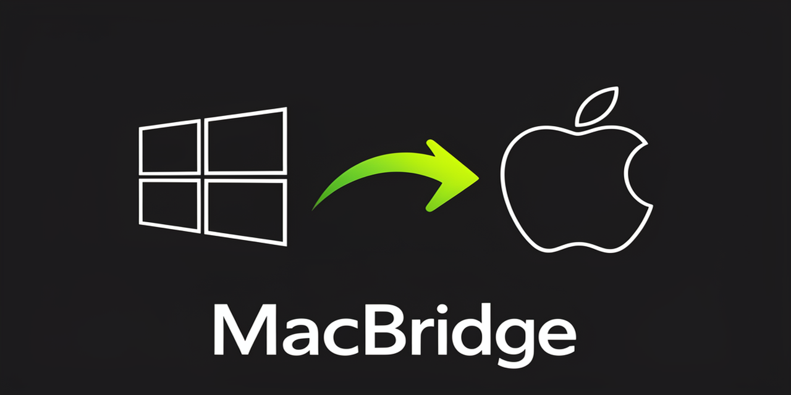

# MacBridge



**Ponte Windows → Mac para build de apps iOS sem precisar do Xcode no Windows.**

Você escreve o código no Windows (VS Code, Zed, editor qualquer), o MacBridge
copia o projeto para um Mac (nuvem ou local) e roda o build (`xcodebuild` /
`swift build`) lá, devolvendo os logs e o artefato para o Windows.

> ⚠️ **Realidade honesta:** o Xcode não roda no Windows e não é portável. O
> MacBridge **não** é um "Xcode para Windows" — é um *fluxo de build remoto*.
> O compilador pesado continua rodando em um Mac (mesmo que alugado na nuvem).
> Isso respeita o EULA da Apple e as leis de engenharia reversa.

---

## Por que existe
Todo dev no Windows que quer fazer app iOS esbarra no mesmo problemas:
precisa de um Mac pra compilar e publicar. O MacBridge automatiza a ponte
Windows ↔ Mac, que hoje é manual e dolorosa.

## Como funciona
```
[ Windows: voce escreve ]  --sync-->  [ Mac: xcodebuild/swift build ]  --log/ipa-->  [ Windows ]
```

Backends:
- `mock` — simula um Mac (desenvolvimento offline, valida o fluxo sem custo)
- `ssh`  — Mac real (nuvem tipo MacinCloud/AWS EC2 Mac, ou Mac na mesma rede)

## Instalação (Windows, via Git Bash / MSYS)
```bash
cd macbridge
python -m pip install -e .
```

## Uso
```bash
# 1. checa ferramentas no PATH (ssh, scp, python, rsync)
macbridge doctor

# 2. configura (modo mock primeiro, pra testar)
macbridge init --backend mock --project MeuApp

# 3. status do "Mac"
macbridge status

# 4. sincroniza + build (e baixa o .ipa de volta pro Windows)
macbridge build
macbridge pull   # baixa o .ipa do Mac para ~/.macbridge/artifacts (re-baixar)

# com Mac real (SSH):
macbridge init --backend ssh --host 10.0.0.5 --user dev --project MeuApp
macbridge build --configuration Release
```

## Extensão VS Code (publicada 🎉)
Instale na loja: **https://marketplace.visualstudio.com/items?itemName=macbridge.macbridge-vscode** (v2.0.0, publisher `macbridge`)

Abre uma "sala de build" (Webview estilo chat) dentro do editor que executa o
CLI `macbridge` de verdade — `build`, `status`, `sync`, `doctor`, `init` — e mostra
o log do Mac remoto. Atalhos: **▶ Build / 📊 Status / 🔄 Sync / 🩺 Doctor**.

```bash
# instalar o .vsix gerado localmente (ou pela loja acima)
code --install-extension vscode/macbridge-0.1.0.vsix
# depois: Ctrl+Shift+P → "MacBridge: Abrir sala de build"
```

## Interface web (UI)
Além da extensão, o MacBridge tem uma UI web autossuficiente:

```bash
macbridge ui --open     # sobe em http://127.0.0.1:8765 e abre o navegador
```
Clique nos atalhos ou digite comandos em linguagem natural — a UI chama o CLI
real (`backend: real`) e exibe o log no chat. Sem o servidor, ela cai em modo mock.

A UI é híbrida: detecta se está numa Webview do VS Code (usa `postMessage`) ou num
navegador (usa `fetch` no endpoint `/api/run`). Compartilha o mesmo `ui/index.html`.

## Build real grátis (GitHub Actions)
O repo já roda `xcodebuild` num **macOS real (free tier)** a cada push/PR:
https://github.com/Derciel/macbridge/actions — prova o conceito sem você ter um Mac.

## Cache de dependências
Para projetos com CocoaPods (`Podfile.lock`), SPM (`Package.resolved`),
Carthage (`Cartfile.resolved`) ou `vendor/`, o MacBridge calcula um
*fingerprint* dos manifestos e **não reenvia** `Pods`/`.build`/`Carthage`/`vendor`
quando nada mudou — economizando centenas de MB por sync. O estado fica num
arquivo `.macbridge_deps.cache` dentro do `remote_path` no Mac.

```bash
macbridge cache            # mostra fingerprint local x remoto e o estado (HIT/MISS)
macbridge cache --reset    # invalida o cache (proximo sync reenvia as deps)
```
Na primeira vez (ou quando os manifestos mudam) o log mostra
`[sync] cache de deps MISS`; depois, `cache de deps HIT` e os diretórios
pesados são pulados.

## Roadmap (open-source, contribuições bem-vindas)
- [x] integração com VS Code (extensão publicada na marketplace)
- [x] download do `.ipa` de volta pro Windows
- [x] interface web (`macbridge ui`) + extensão VS Code
- [x] cache de dependências (não reenviar Pods/SPM a cada build)
- [ ] upload direto pra TestFlight (via `xcrun altool`)
- [ ] suporte a `fastlane` no Mac remoto
- [ ] SaaS build farm (Macs alugados: AWS EC2 Mac / MacStadium + GitHub Actions free)

## Licença
MIT. Não é produto Apple, não é afiliado, não usa marca nem binários da Apple.
